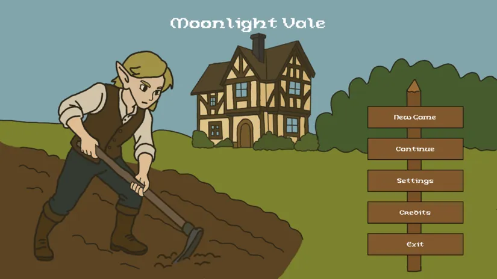
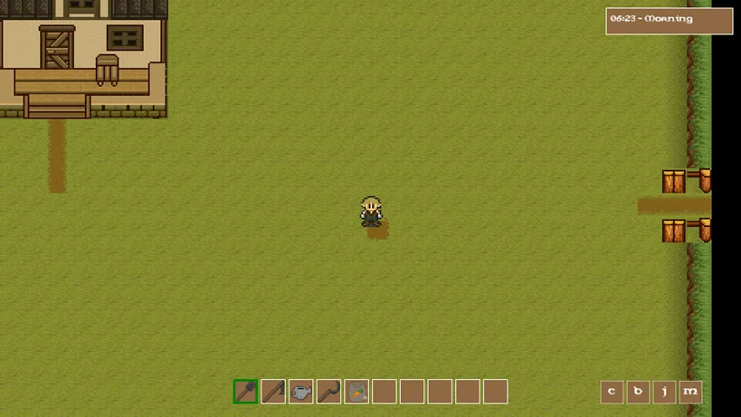

# 🌙 Moonlight Vale

*A cozy farming simulation game built with MonoGame*

## 📖 Description

Moonlight Vale is a farming simulation game inspired by classic titles like Stardew Valley and the work of Eric Barone. Players can till the soil, plant crops, trade with townspeople, and expand their farm in a peaceful, pixel-art setting.

## ✨ Features

### 🚜 Farm System
- **Soil Cultivation** - Use hoes, shovels, and other tools
- **Plant Growing** - Sow carrot, parsnip, and other vegetable seeds
- **Watering** - Take care of your plants using a watering can
- **Harvesting** - Collect ripe crops and sell them for gold

### 🏘️ World Exploration
- **Player Farm** - Your main base with modification possibilities
- **Player House** - A place for rest and sleeping
- **Town** - Trade with NPCs and exploration
- **Shop** - Buy seeds and tools

### 💰 Trading System
- **NPCs** - Trade with various characters
- **Dialogues** - Talk with townspeople
- **Economy** - Manage gold and commodity prices

### ⏰ Time System
- **Day and Night Cycle** - Realistic time system
- **Plant Growth** - Plants grow in real-time
- **Sleep** - Rest to restore energy

## 🎮 Controls

### Basic Controls:
- **WASD** - Movement
- **LShift** - Sprint
- **LMB** - Use tool/seeds
- **RMB** - Harvest crops / Interactions
- **E** - Interact with NPCs
- **B** - Open backpack
- **1-0** - Select item from action bar

### Menu and Interface:
- **ESC** - Game menu
- **I** - Display inventory in console
- **~** - Developer tools
- **Alt+Z** - Hide/show HUD

## 🛠️ Technologies

- **MonoGame Framework** 
- **C# .NET**  
- **Myra UI** 
- **FontStash** 
- **Squared.Tiled** 

## 🚀 Installation and Setup

### Requirements:
- .NET 6.0 or newer
- MonoGame Framework
- Windows/Linux/macOS system

🎯 Development Status
✅ Implemented:

- ✅ Basic player movement system
- ✅ Tools and farming system
- ✅ Plant growth and harvesting
- ✅ Map system and transitions
- ✅ NPCs and dialogues
- ✅ Trading system
- ✅ User interface
- ✅ Time and day system
- ✅ Save/load game

🔄 Work in Progress:

- 🔄 Economy balancing
- 🔄 More plant types
- 🔄 Weather system
- 🔄 Extended NPC dialogues

📋 Planned:

- 📋 Crafting system
- 📋 Livestock animals
- 📋 More maps and locations
- 📋 Quest system
- 📋 Sound effects

🤝 Contributing
This project is open to collaboration! If you want to help:

Report bugs through Issues
Suggest new features
Submit Pull Requests
Help with translations

### 📄 License
This project is available under the MIT License. See the LICENSE file for details.
### 🙏 Acknowledgments

- Eric Barone - For creating Stardew Valley and inspiring this project
- MonoGame Team - For the wonderful framework
- Katelyn Gadd - For the excellent Squared.Tiled library
- Gamedev Community - For support and advice
